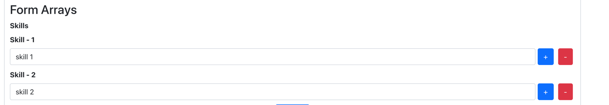

# Getting Started with Create React App

This project was bootstrapped with [Create React App](https://github.com/facebook/create-react-app).

## Available Scripts

In the project directory, you can run:

### `npm start`

Runs the app in the development mode.\
Open [http://localhost:3000](http://localhost:3000) to view it in your browser.

The page will reload when you make changes.\
You may also see any lint errors in the console.


### Using Custom Formik Hook

```
  const formik = useCustomFormik({
        initialState: {
            "username": "sample",
            "email": "",
        },
        onSubmit: submit,
        validate: validate
    })
```

#### Usage 1
---
Separate Handlers

```
<div className="form-field">
    <label htmlFor="username" className="form-label fw-bold">Username</label>
    <input type="text" id="username" className="form-control "
           name="username"
           onChange={formik.handleChange}
           onBlur={formik.handleBlur}
           value={formik.values.username}
    />

    {(formik.errors?.username && formik.touched?.username) ? <div>Username Error </div> : ""}
</div>

```
#### Usage 2
---
Combining Handlers

```
<div className="form-field">
  <label htmlFor="email" className="form-label fw-bold">Email</label>
  <input type="text" id="email" className="form-control" name="email"
  {...formik.getProps('email')} />
</div>

```

#### Displaying Error

```

{(formik.errors?.email && formik.touched?.email) ? <div className="text-danger">Email Error </div> : ""}

```

#### Image


## Using CFormik Tag

CFormik - Main tag which handles validate and submit handlers

CForm - Contains all the custom fields and labels.

CFeild - Used to handle different states.

CErrorMessage - Used to display error message.

```

<CFormik    
            initailValues={initialValues} 
            onSubmit={submit} validate={validate} 
            validateOnChange={false}>

    <CForm>

          <div className="form-field">

                   <label htmlFor="email" className="form-label fw-bold">Email</label>

                   <CFeild type="email" id="email" name="email" className="form-control"></CFeild>

<!--------------------------------- Error Message -------------------------------------->

                   <CErrorMessage name="email"></CErrorMessage>
          </div>

    </CForm>

</CFormik>

```

### CFeild Usages

#### Usage 1

```

<CFeild type="email" id="email" name="email" className="form-control"></CFeild>

```

#### Usage 2

```

<CFeild type="text" id="username" name="username" className="form-control">

  { (props) => {

 return (
    <input
      type="text"
      id="username"
      className="form-control"
      name="{props.name}"
      {...props.form.getProps(props.name)}
  />
  ) } }

</CFeild>

```

#### Usage 3 - Array Usage

```

<CFeild
        type="text"
        id="phone_1"
        placeholder="Phone 1"
        name="phone[0]"
        className="form-control"
></CFeild>

<CFeild
        type="text"
        id="phone_2"
        placeholder="Phone 2"
        name="phone[1]"
        className="form-control"
></CFeild>

```

## Error Message

CErrorMessage - Used to display different error messages.


#### Usage 1 - Display default message

```

<CErrorMessage name="email"></CErrorMessage>

```


#### Usage 2 - Displaying error message in component.

```

<CErrorMessage name="username" component="div"></CErrorMessage>

```

#### Usage 3 - Displaying error message in with custom component.

```

<CErrorMessage name="username" component="{TextError}"></CErrorMessage>

```

#### Usage 4 - Displaying custom message with component.


```

<CErrorMessage name="username">

                    { (errorMsg) => { 
                        return (
                                <div className="error">{errorMsg}</div>
                            ) 
                    } }
</CErrorMessage>


```


## Form Array

CFormArray - Used to create array components.

```

<CFormArray name="skills">
    {
        (props) => {

            const {values, push, remove} = props;
            const {skills} = values

            return (

                <div className="skills">
                    {
                        skills.map((name, index) => {
                            return (
                                <div key={index}>
                                    <label htmlFor={`skill_${index}`}
                                           className="form-label fw-bold">Skill
                                        - {index + 1}</label>
                                    <div className="d-flex skill">
                                        <CFeild name={`skills[${index}]`}
                                                id={`skill_${index}`}
                                                className="form-control"></CFeild>

                                        <Button type="button"
                                                className={"btn btn-primary actions"}
                                                onClick={() => push(index)}> + </Button>
                                        <Button type="button"
                                                className={"btn btn-danger actions"}
                                                onClick={() => {
                                                    remove(index)
                                                }}> - </Button>
                                    </div>
                                </div>
                            )
                        })
                    }

                </div>
            )
        }
    }
</CFormArray>

```



